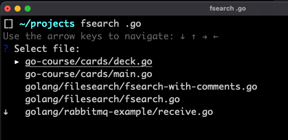

A CLI tool created with the help of ChatGPT to recursively search a directory for specified file names.

Search for a file name, file extension, whatever, and the program will return a list of matching files. Use arrows to select,
hit enter, and it'll open that file however you want it. Currently it's hard coded to open the file in Goland.

`fsearch-with-comments.go` contains comments around the logic of the program to explain functionality.

I've added the with comments file because I like the idea of having anything I build with ChatGPT have an explanation,
for the benefit of actually learning about what's happening in the code, for anyone (including me) who reads it.

I used ChatGPT here as an experiment to see how well it could build a tool that I wanted, and it did a pretty great job.
I didn't know anything about filetree walkers before this, so it was a great learning exercise. And I get a pretty neat tool out of it too.

